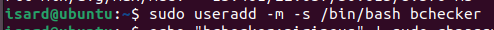

# Documentación Técnica: Servidor Web (W-NCC)

## 1. Descripción del Servicio
Este documento detalla el despliegue, configuración y puesta en marcha del **Servidor Web (W-NCC)** para el proyecto de infraestructura P0.0. Este servidor actúa como *Frontend* de la arquitectura, alojando el servidor Apache y la aplicación PHP encargada de procesar las peticiones de los clientes y visualizar los datos almacenados en el servidor de Base de Datos.

### 1.1. Información General del Host
* **Hostname:** W-NCC
* **Sistema Operativo:** Ubuntu Server 22.04 LTS
* **IP Asignada:** 192.168.22.10 (Mascara /24)
* **Red:** DMZ (Zona Desmilitarizada)
* **Función:** Servidor Web (Apache + PHP)

---

## 2. Gestión de Usuarios y Accesos
Para cumplir con los requisitos del proyecto y asegurar la auditabilidad del sistema, se procedió a la creación del usuario administrador estandarizado.

### 2.1. Creación del Usuario 'bchecker'
Se creó el usuario `bchecker` y se le asignaron permisos de administración (sudo) para permitir la gestión del servidor.

**Comandos ejecutados:**
1.  **Creación del usuario:** Se utilizó el comando `useradd` para registrar el usuario en el sistema y crear su directorio personal.
    ```bash
    sudo useradd -m -s /bin/bash bchecker
    ```
    
    
2.  **Asignación de contraseña:** Se estableció la contraseña requerida.
    ```bash
    sudo passwd bchecker
    ```
3.  **Permisos de Administrador:** Se añadió el usuario al grupo *sudo* para permitirle ejecutar tareas administrativas.
    ```bash
    sudo usermod -aG sudo bchecker
    ```

> **[IMAGEN]:** *Captura de pantalla mostrando la ejecución de los comandos y la verificación con `id bchecker`.*
