# Documentación Técnica: Servidor Web (W-NCC)

## 1. Descripción del Servicio
Este documento detalla el despliegue, configuración y puesta en marcha del **Servidor Web (W-NCC)** para el proyecto de infraestructura P0.0. Este servidor actúa como *Frontend* de la arquitectura, alojando el servidor Apache y la aplicación PHP encargada de procesar las peticiones de los clientes y visualizar los datos almacenados en el servidor de Base de Datos.

### 1.1. Información General del Host
* **Hostname:** W-NCC
* **Sistema Operativo:** Ubuntu Server 22.04 LTS
* **IP Asignada:** 192.168.22.10 (Mascara /24)
* **Red:** DMZ (Zona Desmilitarizada)
* **Función:** Servidor Web (Apache + PHP)

---

## 2. Gestión de Usuarios y Accesos
Para cumplir con los requisitos del proyecto y asegurar la auditabilidad del sistema, se procedió a la creación del usuario administrador estandarizado.

### 2.1. Creación del Usuario 'bchecker'
Se creó el usuario `bchecker` y se le asignaron permisos de administración (sudo) para permitir la gestión del servidor.

* **Usuario:** `bchecker`
* **Password:** `bchecker121`
* **Permisos:** Se añadió al grupo `sudo` para tareas administrativas.

**Comandos ejecutados:**
1.  **Creación del usuario:** Se utilizó el comando `useradd` para registrar el usuario en el sistema y crear su directorio personal.
    ```bash
    sudo useradd -m -s /bin/bash bchecker
    ```
    
    
2.  **Asignación de contraseña:** Se estableció la contraseña requerida.
    ```bash
    sudo passwd bchecker
    ```
    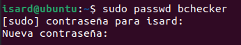
    
3.  **Permisos de Administrador:** Se añadió el usuario al grupo *sudo* para permitirle ejecutar tareas administrativas.
    ```bash
    sudo usermod -aG sudo bchecker
    ```
    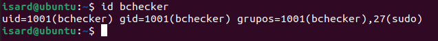

---

## 3. Configuración de Red e Interfaces
Debido a la arquitectura del proyecto, el servidor Web se ubica en la **DMZ**. Para garantizar la comunicación correcta y evitar conflictos con las interfaces por defecto de la virtualización, se realizó una configuración manual estricta.

### 3.1. Definición de Parámetros (Netplan)
Se editó el archivo de configuración de red para asignar la IP estática y la puerta de enlace (Gateway) hacia el Router del proyecto.

* **Archivo:** `/etc/netplan/00-installer-config.yaml`
* **Interfaz activa:** `enp3s0`

**Código de configuración aplicado:**
```yaml
# Let NetworkManager manage all devices on this system
network:
  version: 2
  ethernets:
    enp3s0:
      addresses:
        - 192.168.22.10/24
      gateway4: 192.168.22.1
      nameservers:
        addresses:
          - 8.8.8.8
```
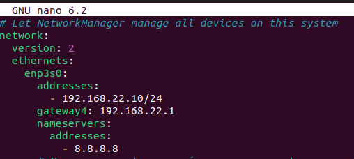


### 3.2. Gestión y Limpieza de Interfaces
Durante el despliegue, se detectó que el sistema activaba múltiples interfaces de red (`enp1s0`, `enp2s0`) que generaban **conflictos de enrutamiento** (el tráfico intentaba salir por la interfaz equivocada).

**Solución aplicada:**
Se procedió a deshabilitar manualmente las interfaces redundantes para forzar que todo el tráfico fluyera exclusivamente por la interfaz configurada (`enp3s0`), asegurando así que el tráfico con destino a la Intranet pasara por la ruta correcta.

**Comandos de gestión de interfaces:**
```bash
sudo ip link set enp1s0 down
sudo ip link set enp2s0 down
# Una vez deshabilitadas las interfaces redundantes, se aplicó 'sudo netplan apply'
# para asegurar que la interfaz principal se activara con los parámetros definidos.
```
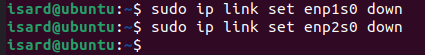

### 3.3. Verificación Final
Tras aplicar la configuración (`sudo netplan apply`), se verificó que solo la interfaz correcta tenía IP y conexión, y que la comunicación con el Gateway (Router R-NCC) se estableció correctamente.

**Estado de la IP:**
Se comprobó que la interfaz principal (`enp3s0`) tenía asignada la dirección estática definida (`192.168.22.10/24`).

```bash
ip r
```
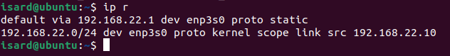

Prueba de conexión: Se validó la conectividad al Router. Este paso es fundamental para confirmar que la comunicación entre el Servidor Web (DMZ) y el Router funciona.

```bash
ping 192.168.22.1 #Router
ping 192.168.22.11 #BBDD
```
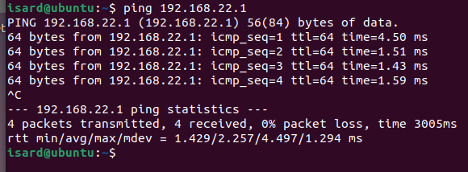
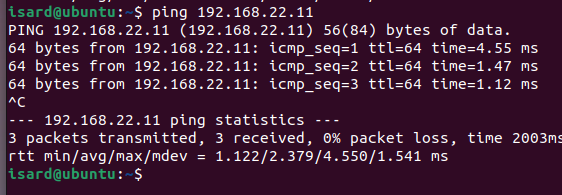


---

## 4. Instalación de Servicios

Para habilitar la funcionalidad completa del Web Server (W-NCC), se instalaron los siguientes componentes esenciales: el servidor HTTP (apache2), el intérprete de código (php) junto con el módulo de integración (libapache2-mod-php) y el conector de base de datos (php-mysql). Además, para facilitar las pruebas de conectividad y la administración remota, se incluyeron el cliente de BBDD (mariadb-client) y el servidor de acceso seguro (openssh-server).

### 4.1. Actualización de Repositorios
Antes de instalar cualquier paquete, es un paso obligatorio y de buenas prácticas actualizar el índice de paquetes local del sistema para asegurar que se utilicen las versiones más recientes y estables.

```bash
sudo apt update
```
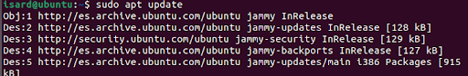


### 4.2. Instalación de Paquetes
Se utilizó el siguiente comando de instalación, asegurando que todos los componentes requeridos estuvieran presentes:

```bash
sudo apt install apache2 php libapache2-mod-php php-mysql mariadb-client openssh-server -y
```
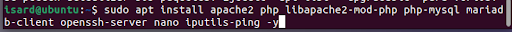

| Paquete Instalado | Función Principal | Propósito en el Proyecto |
| :--- | :--- | :--- |
| **apache2** | Servidor HTTP | Servir la página web. |
| **php / libapache2-mod-php** | Lenguaje de scripting | Procesar el `index.php` que consulta la BBDD. |
| **php-mysql** | Conector PHP | Permite a la aplicación comunicarse con MariaDB (BBDD). |
| **mariadb-client** | Cliente MySQL | Herramienta de terminal para verificar la conexión (`mysql -h...`). |
| **openssh-server** | Servidor SSH | **Obligatorio** para el acceso remoto con el usuario `bchecker`. |


### 4.3. Verificación de Componentes Instalados

#### 1. Verificación de Servicios

##### 1.1. Servidor Web (Apache2)
**Comando de Verificación:**
```bash
sudo systemctl status apache2
```
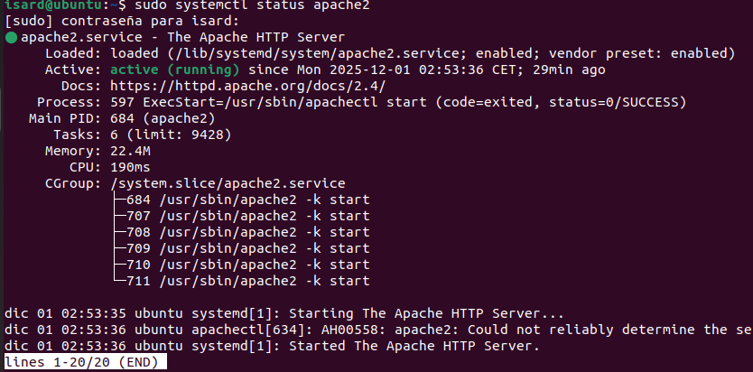

##### 1.2. Servidor SSH
**Comando de Verificación:**
```bash
sudo systemctl status ssh
```
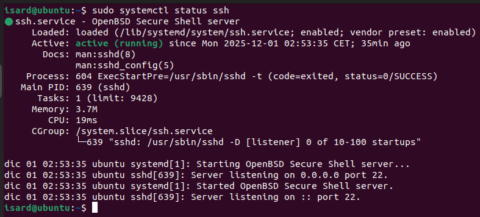


#### 2. Verificación de Módulos y Clientes

##### 2.1. Componentes PHP
a) Intérprete PHP:

```bash
php -v
```

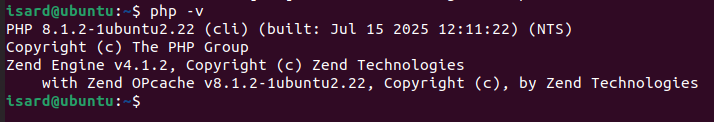


b) Módulo Apache: (Confirma que PHP puede ejecutarse en la web)

```bash
apache2ctl -M | grep php
```
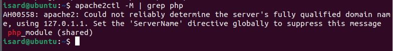


##### 2.2. Conector de Base de Datos
**Comando de Verificación:**
```bash
php -m | grep mysql
```


##### 2.3. Herramienta Cliente MariaDB
**Comando de Verificación:**

```bash
mysql --version
```
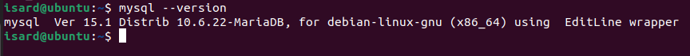


##### 2.4. Utilidad de Diagnóstico de Red
**Comando de Verificación:**

```bash
ping -V
```
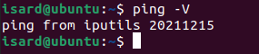


#### 3. Prueba Funcional
```bash
sudo ss -tuln  # Verificar si el puerto 80 está escuchando
curl localhost # Verificar que Apache responde
```
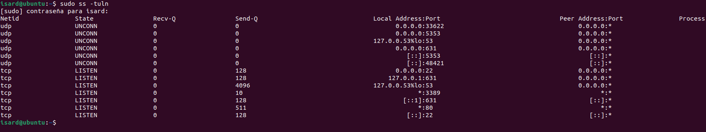

### 4.4. Configuración de Acceso Remoto al Servicio MySQL
Para permitir que el servidor Web pueda acceder a la BBDD, se debe asegurar que el puerto por defecto de MySQL (3306) esté abierto en el firewall del servidor.
Comandos ejecutados en el servidor de BBDD :

1. Apertura del Puerto 3306

```bash 
sudo ufw allow 3306/tcp
```
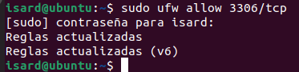

2. Recarga del Firewall

```bash 
sudo ufw reload
```


---

## 5. Despliegue de la Aplicación y Conexión Final
En esta sección se documenta la implementación del script PHP encargado de procesar la solicitud del cliente, conectar con el servidor de Base de Datos (BBDD) y renderizar los datos.

### 5.1. Eliminación del Contenido Estático
Antes de crear el script dinámico, se eliminó el archivo index.html predeterminado para asegurar que Apache priorice la ejecución del archivo PHP y no se produzcan conflictos.
**Comando de Verificación:**
```bash
sudo rm /var/www/html/index.html
```
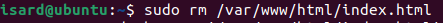


### 5.2. Implementación del Script PHP
Se creó el archivo index.php en el directorio del servidor web (/var/www/html/).
```bash
sudo nano /var/www/html/index.php
```
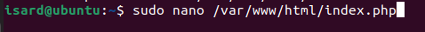

**Lógica del Script:**

1.  Define los parámetros de conexión (`servername`, `username`, `password`, `dbname`).
2.  Establece la conexión al puerto 3306 del servidor BBDD (`192.168.22.11`).
3.  Si la conexión es exitosa, ejecuta la consulta `SELECT * FROM centres_educatius`.
4.  Muestra los resultados de forma dinámica en una tabla HTML.

Código del Script:
```bash
// ==========================================
// CONFIGURACIÓN DE LA CONEXIÓN
// ==========================================
// IP del servidor de Base de Datos (B-NCC).
// Pon aquí la IP que tenga tu compañero (ej. 192.168.22.11 o 192.168.20.10)
$servername = "192.168.22.11";

// Usuario del proyecto (definido en el PDF)
$username = "bchecker";

// Contraseña (usa 'pirineus' si la cambiaste, o 'bchecker121' si es la original)
$password = "bchecker121";

// Nombre de la BBDD y la Tabla (confírmalo con tu compañero)
$dbname = "equipaments_bcn";
$tablename = "centres_educatius";

// Crear la conexión
$conn = new mysqli($servername, $username, $password, $dbname);
?>

<!DOCTYPE html>
<html lang="es">
<head>
    <meta charset="UTF-8">
    <title>P0.0 - Datos Barcelona</title>
    <style>
        body { font-family: sans-serif; margin: 20px; background-color: #f4f4f4; }
        .container { background: white; padding: 20px; border-radius: 8px; box-shadow: 0 0 10px rgba(0,0,0,0.1); }
        h1 { color: #333; border-bottom: 2px solid #007bff; padding-bottom: 10px; }

        /* Estilos de la tabla */
        table { width: 100%; border-collapse: collapse; margin-top: 20px; font-size: 0.9em; }
        th, td { padding: 12px; border-bottom: 1px solid #ddd; text-align: left; }
        th { background-color: #007bff; color: white; }
        tr:hover { background-color: #f1f1f1; }

        /* Cajas de estado */
        .status-ok { color: green; font-weight: bold; padding: 10px; background: #e6fffa; border: 1px solid green; }
        .status-err { color: red; font-weight: bold; padding: 10px; background: #ffe6e6; border: 1px solid red; }
    </style>
</head>
<body>

<div class="container">
    <h1>Listado de Equipamientos (Desde B-NCC)</h1>
    <p>Servidor Web: <strong>W-NCC</strong> (IP: <?php echo $_SERVER['SERVER_ADDR']; ?>)</p>

    <?php
    // 1. VERIFICAR CONEXIÓN
    if ($conn->connect_error) {
        echo "<div class='status-err'>";
        echo "❌ Error de conexión con B-NCC: " . $conn->connect_error;
        echo "<br><small>Verifica la IP, el usuario, la contraseña o el Firewall del servidor de BBDD.</small>";
        echo "</div>";
        die(); // Detener si no hay conexión
    } else {
        echo "<div class='status-ok'>✅ Conexión exitosa a la base de datos: $dbname</div>";
    }

    // 2. CONSULTA SQL
    $sql = "SELECT * FROM $tablename";
    $result = $conn->query($sql);

    // 3. MOSTRAR DATOS
    if ($result) {
        if ($result->num_rows > 0) {
            echo "<table><thead><tr>";

            // Pintar cabeceras automáticamente
            $fields = $result->fetch_fields();
            foreach ($fields as $field) {
                echo "<th>" . htmlspecialchars($field->name) . "</th>";
            }
            echo "</tr></thead><tbody>";

            // Pintar filas de datos
            while($row = $result->fetch_assoc()) {
                echo "<tr>";
                foreach($row as $data) {
                    echo "<td>" . htmlspecialchars($data) . "</td>";
                }
                echo "</tr>";
            }
            echo "</tbody></table>";
        } else {
            echo "<p>La conexión funciona, pero la tabla <strong>$tablename</strong> está vacía.</p>";
        }
    } else {
        echo "<div class='status-err'>";
        echo "❌ Error en la consulta SQL.<br>";
        echo "Posible causa: La tabla '$tablename' no existe.<br>";
        echo "Error técnico: " . $conn->error;
        echo "</div>";
    }

    $conn->close();
    ?>
</div>

</body>
</html>
```

### 5.3. Verificación de la Conexión a BBDD
Se comprobó que el servidor Web podía conectar al servicio MySQL, validando que el forwarding del Router y los permisos de usuario en la BBDD fueran correctos.
Prueba de Conexión:
```bash
mysql -h 192.168.22.11 -u bchecker -p #Se comprueba la conexión con el usuario bchecker con la BBDD
```


---
## 6. Seguridad y Firewall (UFW)

Es crítico implementar medidas de seguridad para que no hayan problemas graves. Se utilizó **UFW** para las reglas de red.

### 6.1. Definición de Políticas por Defecto
Como medida de seguridad base, se bloquearon todas las conexiones entrantes para asegurar que ningún puerto innecesario quedara expuesto accidentalmente.

```bash
sudo ufw default deny incoming
sudo ufw default allow outgoing
```
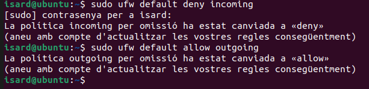
### 6.2. Apertura de Puertos de Servicio
Se habilitaron únicamente los puertos necesarios para los servicios que se iban a utilizar:

```bash
sudo ufw allow 22/tcp
sudo ufw allow 80/tcp
```
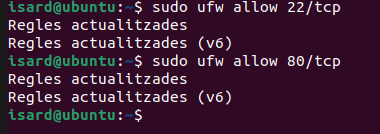


### 6.3. Activación y Verificación
Una vez creada las reglas del firewall lo activamos y verificamos el estado.

```bash
sudo ufw enable
sudo ufw status verbose
```
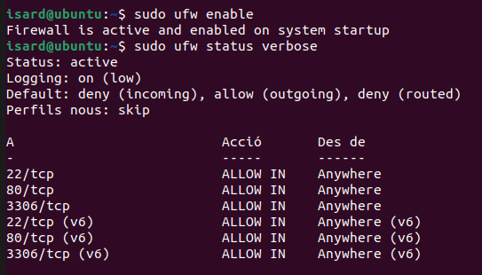

---
## 7. Problemas Encontrados y Soluciones

Durante el proyecto surgieron varios problemas con distintas funciones y servicios. Estos son algunos de los muchos que han surgido y su solución.

### Error "Connection Refused" (111)
* **Problema:** El log de Apache mostraba `mysqli_sql_exception: Connection refused` al intentar conectar con la BBDD.
* **Causa:** La Base de Datos (MariaDB) estaba configurada por defecto para escuchar solo en `127.0.0.1` (localhost), rechazando conexiones externas.
* **Solución:** Se modificó la configuración del servidor BBDD (`/etc/mysql/mariadb.conf.d/50-server.cnf`) cambiando el `bind-address` a `0.0.0.0` y se reinició el servicio.

### Error "Host not allowed to connect"
* **Problema:** La conexión llegaba a la BBDD pero era rechazada con un error de permisos.
* **Causa:** El usuario `bchecker` no tenía permisos para conectarse desde la IP de la DMZ (`%`).
* **Solución:** Se ejecutó en la base de datos el comando: `GRANT ALL PRIVILEGES... TO 'bchecker'@'%'`.

### Error de Librería PHP ("Pantalla Blanca")
* **Problema:** La página web se mostraba en blanco sin mensajes de error.
* **Causa:** Faltaba la librería `php-mysql`, por lo que PHP no sabía cómo ejecutar las funciones de base de datos y se detenía fatalmente.
* **Solución:** Se instaló el paquete faltante (`sudo apt install php-mysql`) y se reinició Apache.

### Timeout de Conexión (Error 2002/115)
* **Problema:** Durante las pruebas finales, se obtuvo un error de tiempo de espera (*Connection timed out*).
* **Causa:** El servidor de Base de Datos estaba apagado o desconectado de la red `net-Intranet`.
* **Solución:** Se verificó el encendido de las máquinas y la correcta conexión a las redes virtuales en Isard.

---
## 8. Pruebas Finales y Resultado
### 8.1. Acceso y Visualización de la Web

Se comprueba si la implemetanción ha sido correcta y se procede a visualizar la Web

1. Máquina de Prueba: Cliente Linux/Windows
2. URL de Acceso: http://192.168.22.10

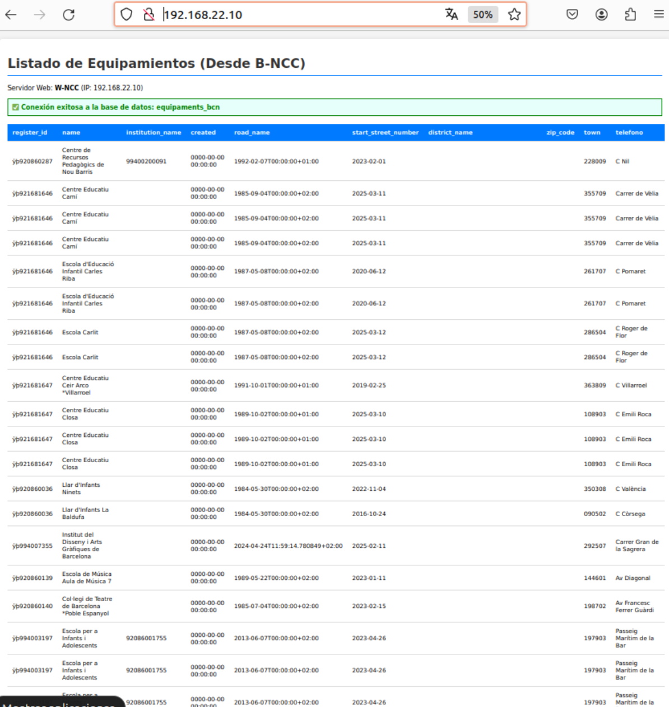


